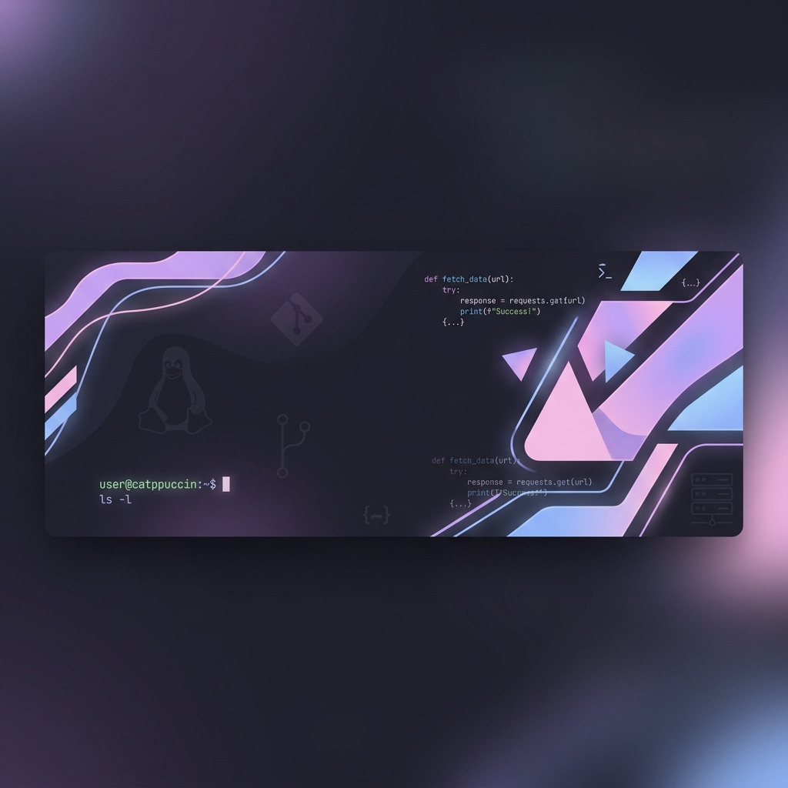

 
 

 

###  Sobre mí
Soy un desarrollador de software y un gran apasionado del ecosistema Linux (actualmente utilizando CachyOS como sistema principal). Tengo experiencia sólida administrando servidores, optimizando bases de datos y gestionando infraestructuras de alto rendimiento para entornos como Minecraft, Pterodactyl y Paper. 

Actualmente sigo ampliando mis conocimientos explorando diversas tecnologías, desde el desarrollo backend hasta integraciones modernas con APIs. Mi enfoque principal radica en crear soluciones eficientes, asegurar la estabilidad de los sistemas, brindar soporte técnico y seguir creciendo profesionalmente.

 

###  Stack Tecnológico

       

 

###  Proyectos Destacados

 

###  Estadísticas

